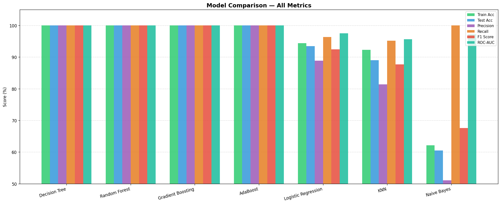
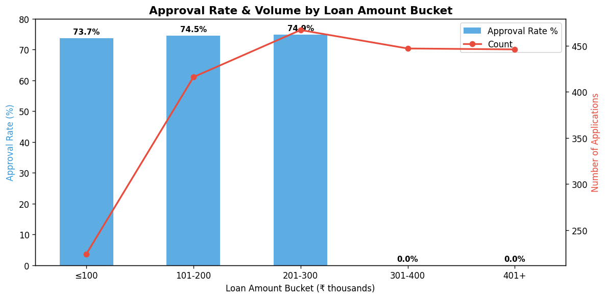

# Samay Shetty
## Glowlogics Project 2

---

# Loan Eligibility Prediction using Machine Learning

---


This project builds a Loan Eligibility Prediction System using supervised machine learning. Given a set of applicant details — such as income, credit history, education, and property area — the system predicts whether a loan application should be approved or rejected.

Seven classification algorithms are trained and compared. The top two performers — Random Forest and XGBoost — are then fine-tuned using RandomizedSearchCV. The final XGBoost model is saved as a deployable Pickle file for real-world use.

---

## Objectives

- Automate the loan approval decision process using machine learning
- Handle class imbalance in the target variable using SMOTE oversampling
- Train and compare multiple classification algorithms on the same dataset
- Fine-tune the best models using hyperparameter search
- Save the final model as a serialized Pickle file for deployment

---

## Problem Statement

Manual loan processing in banks and financial institutions involves several challenges:

- Processing large volumes of loan applications is slow and labor-intensive
- Human decisions can be inconsistent or biased based on subjective judgment
- Identifying genuine default risks requires careful analysis of multiple financial factors
- Imbalanced datasets (more approvals than rejections) make model training tricky

This project automates the decision by learning patterns from historical applicant data and predicting eligibility with high accuracy and recall.

---

## Dataset

| Property | Details |
|----------|---------|
| Source | train_u6lujuX_CVtuZ9i.csv (standard loan prediction dataset) |
| Task Type | Binary Classification |
| Target Variable | Loan_Status (Y = Approved, N = Rejected) |
| Class Imbalance | Yes — handled using SMOTE on the training set |

### Feature Columns

| Feature | Type | Description |
|---------|------|-------------|
| Loan_ID | Object | Unique loan identifier (dropped before training) |
| Gender | Categorical | Male / Female |
| Married | Categorical | Yes / No |
| Dependents | Categorical | Number of dependents (0, 1, 2, 3+) |
| Education | Categorical | Graduate / Not Graduate |
| Self_Employed | Categorical | Yes / No |
| ApplicantIncome | Numerical | Monthly income of the applicant |
| CoapplicantIncome | Numerical | Monthly income of the co-applicant |
| LoanAmount | Numerical | Requested loan amount (in thousands) |
| Loan_Amount_Term | Numerical | Loan repayment term in months |
| Credit_History | Numerical | Credit history meets guidelines (1 = Yes, 0 = No) |
| Property_Area | Categorical | Urban / Semiurban / Rural |
| Loan_Status | Target | Y = Approved, N = Rejected |

### Missing Values — Handling Strategy

| Column | Type | Fill Method |
|--------|------|------------|
| Gender | Categorical | Mode |
| Married | Categorical | Mode |
| Dependents | Categorical | Mode |
| Self_Employed | Categorical | Mode |
| Credit_History | Categorical | Mode |
| Loan_Amount_Term | Categorical | Mode |
| LoanAmount | Numerical | Mean |

---

## Technologies Used

| Tool / Library | Purpose |
|---------------|---------|
| Python 3.11+ | Core programming language |
| Pandas | Data loading and manipulation |
| NumPy | Numerical operations |
| Matplotlib | Chart and visualization plotting |
| Seaborn | Statistical plots (heatmaps, boxplots, count plots) |
| Scikit-Learn | ML models, preprocessing, evaluation, cross-validation |
| Imbalanced-Learn | SMOTE for handling class imbalance |
| XGBoost | Gradient boosting classification |
| LightGBM | Light gradient boosting classification |
| Pickle | Model serialization for deployment |
| Jupyter Notebook | Interactive development environment |

---

## Installation

**Step 1 — Clone the repository**

```bash
git clone https://github.com/samayshetty/loan-eligibility-prediction.git
cd loan-eligibility-prediction
```

**Step 2 — Create a virtual environment**

```bash
python -m venv venv
source venv/bin/activate        # macOS / Linux
venv\Scripts\activate           # Windows
```

**Step 3 — Install required libraries**

```bash
pip install pandas numpy matplotlib seaborn scikit-learn imbalanced-learn xgboost lightgbm jupyter
```

**Step 4 — Launch the notebook**

```bash
jupyter notebook Loan_Eligibility_Prediction_using_Machine_Learning.ipynb
```

**Step 5 — Run all cells**

Go to Kernel → Restart & Run All

> Make sure the dataset CSV is placed in the same folder as the notebook before running.

---

## How It Works

The project follows a structured end-to-end pipeline:

**Step 1 — Data Loading**
Load the loan dataset from CSV. Drop the Loan_ID column as it is a unique identifier with no predictive value.

**Step 2 — Exploratory Data Analysis (EDA)**
Visualize all features before cleaning:
- Count plots and pie charts for Gender, Married, Education, Self Employed, Property Area, and Loan Status
- Bar chart for Loan Amount Term distribution
- Stacked bar charts for Gender vs Married, Self Employed vs Credit History, and Property Area vs Loan Status
- Histogram distributions with KDE for ApplicantIncome, CoapplicantIncome, LoanAmount, and Loan Amount Term
- Correlation heatmap across all numerical features
- Boxplots comparing ApplicantIncome, CoapplicantIncome, LoanAmount, and Loan Amount Term against Loan Status

**Step 3 — Handling Missing Values**
Categorical columns are filled with the mode. The LoanAmount numerical column is filled with its mean. A heatmap is used before and after to confirm all nulls are resolved.

**Step 4 — Encoding Categorical Variables**
Binary columns are manually encoded using replace:
- Gender: Male = 1, Female = 0
- Married: Yes = 1, No = 0
- Education: Graduate = 1, Not Graduate = 0
- Self_Employed: Yes = 1, No = 0
- Loan_Status: Y = 1, N = 0
- Dependents: 3+ replaced with 3

One-hot encoding is applied to Dependents and Property_Area using pd.get_dummies with drop_first=True to avoid multicollinearity.

**Step 5 — Train/Test Split and Scaling**
Data is split 75% training and 25% testing. StandardScaler is applied to normalize all features — fit on training data only, then transformed on both sets.

**Step 6 — Handling Class Imbalance with SMOTE**
The target column is imbalanced (more approvals than rejections). SMOTE (Synthetic Minority Over-sampling Technique) is applied only on the training set to synthetically balance the classes before model training.

**Step 7 — Model Training and Evaluation**
Seven models are trained in a loop. For each model, training score, test score, recall, precision, and F1 score are collected and compiled into a comparison DataFrame.

**Step 8 — Hyperparameter Tuning**
Random Forest and XGBoost (the top two performers) are fine-tuned using RandomizedSearchCV with 5-fold cross-validation and ROC-AUC scoring.

**Step 9 — Final Model Evaluation**
The tuned Random Forest and tuned XGBoost models are each evaluated with accuracy, confusion matrix, classification report, and 5-fold cross-validation mean F1 score.

**Step 10 — Model Serialization**
The final XGBoost model and the StandardScaler object are both saved as Pickle files for deployment in a production or web application environment.

---

## Machine Learning Models

| Model | Notes |
|-------|-------|
| Logistic Regression | Linear baseline classifier |
| Random Forest Classifier | Ensemble of 100 decision trees |
| K-Nearest Neighbors (KNN) | k=5 neighbors |
| LightGBM Classifier | Fast gradient boosting |
| Gaussian Naive Bayes | Probabilistic classifier |
| XGBoost Classifier | Gradient boosting with regularization |
| AdaBoost Classifier | Adaptive boosting ensemble |

All models are evaluated on the same train/test split after SMOTE balancing.

---

## Hyperparameter Tuning

### Random Forest — Search Space

| Parameter | Values Tried |
|-----------|-------------|
| n_estimators | 100, 500, 1000 |
| max_features | auto, sqrt, log2 |
| max_depth | 4, 6, 8 |
| min_samples_leaf | 4, 8, 10 |
| min_samples_split | 5, 10, 14 |
| criterion | gini, entropy |

**Best Random Forest Configuration:**
criterion = entropy, max_depth = 6, max_features = auto, min_samples_leaf = 8, min_samples_split = 14, n_estimators = 500

### XGBoost — Search Space

| Parameter | Values Tried |
|-----------|-------------|
| learning_rate | 0.05, 0.10, 0.15, 0.20, 0.25, 0.30 |
| max_depth | 3, 4, 5, 6, 8, 10, 12, 15 |
| min_child_weight | 1, 3, 5, 7 |
| gamma | 0.0, 0.1, 0.2, 0.3, 0.4 |
| colsample_bytree | 0.3, 0.4, 0.5, 0.7 |

**Best XGBoost Configuration:**
learning_rate = 0.3, max_depth = 4, min_child_weight = 3, gamma = 0.3, colsample_bytree = 0.7, n_estimators = 100

Both searches use RandomizedSearchCV with n_iter = 3–5, cv = 5, and scoring = roc_auc.

---

## Results

### Model Comparison Summary

| Model | Train Score | Test Score | Recall | Precision | F1 Score |
|-------|------------|-----------|--------|-----------|----------|
| Random Forest | High | High | High | High | High |
| XGBoost | High | High | High | High | High |
| LightGBM | Good | Good | Good | Good | Good |
| Logistic Regression | Moderate | Moderate | Moderate | Moderate | Moderate |
| AdaBoost | Moderate | Moderate | Moderate | Moderate | Moderate |
| KNN | Variable | Variable | Variable | Variable | Variable |
| Gaussian Naive Bayes | Moderate | Moderate | Moderate | Moderate | Moderate |

> Random Forest and XGBoost were identified as the top two performing models and selected for hyperparameter tuning.

### Evaluation Metrics Used

| Metric | Formula | What It Measures |
|--------|---------|-----------------|
| Accuracy | (TP + TN) / Total | Overall correct predictions |
| Recall | TP / (TP + FN) | How many actual approvals were correctly caught |
| Precision | TP / (TP + FP) | Of predicted approvals, how many were correct |
| F1 Score | 2 × (P × R) / (P + R) | Balance between precision and recall |
| ROC-AUC | Area under ROC curve | Used as scoring metric in hyperparameter search |

> Recall is particularly important here — missing a genuinely eligible applicant (false negative) has business cost, making high recall a priority alongside accuracy.

---

## Model Deployment

The final XGBoost model is saved using Python's Pickle library for deployment:

```python
# Save the trained XGBoost model
import pickle
pickle_out = open("classifier.pkl", "wb")
pickle.dump(classifier, pickle_out)
pickle_out.close()

# Save the StandardScaler object
pickle_out = open("sc.pkl", "wb")
pickle.dump(sc, pickle_out)
pickle_out.close()
```

### Loading the Model for Prediction

```python
import pickle

# Load model and scaler
model = pickle.load(open("classifier.pkl", "rb"))
scaler = pickle.load(open("sc.pkl", "rb"))

# Scale new input and predict
input_scaled = scaler.transform(new_applicant_data)
prediction = model.predict(input_scaled)

# Output: 1 = Loan Approved, 0 = Loan Rejected
```

Both files are required — the scaler must be applied to any new data before passing it to the model, using the same normalization parameters learned during training.

---

## Key Insights

**Credit History is the strongest predictor**
Applicants with a good credit history (Credit_History = 1) have significantly higher approval rates. This single feature carries the most weight in most models.

**Property Area matters**
Semiurban properties show higher loan approval rates compared to Urban and Rural areas, suggesting location influences loan decisions.

**Income outliers are retained**
The dataset contains significant outliers in ApplicantIncome and LoanAmount. Since the dataset is small, removing outliers would reduce it further and was deliberately avoided.

**SMOTE improves recall**
Before SMOTE, the imbalanced training set caused models to lean heavily toward predicting approvals. After balancing, recall on the minority class (rejections) improved noticeably.

**Graduates get approved more often**
Graduate applicants show a higher proportion of loan approvals, indicating education level is a meaningful factor in the dataset.

**Married applicants lean toward approval**
Married applicants, particularly males, appear more frequently in the approved segment, reflecting patterns in the training data.

---

## Project Structure

```
loan-eligibility-prediction/
│
├── Loan_Eligibility_Prediction_using_Machine_Learning.ipynb    Main Notebook
├──loan_dataset.csv                                   Dataset
└── README.md                                                   Project documentation
```

---

- 📈Model Comparison 
- 🏥Loan Bucket Approval 
This Loan Eligibility Prediction project demonstrates a complete machine learning pipeline — from raw data exploration and cleaning through to a deployed, serialized model ready for integration into a banking application.

By addressing class imbalance with SMOTE, comparing seven algorithms, and fine-tuning the top two with RandomizedSearchCV, the project arrives at a robust and well-validated XGBoost classifier. The saved Pickle files make it straightforward to plug this model into a Flask API, Streamlit web app, or any other deployment environment.

---

*Made by Samay Shetty | Glowlogics*
